# 📋 ContractIQ

<div align="center">
  
  [](https://fastapi.tiangolo.com)
  [](https://streamlit.io)
  [](https://langchain.com)
  [](https://postgresql.org)
  [](https://groq.com)
  [](https://huggingface.co)
  
  **Intelligent contract analysis powered by Retrieval-Augmented Generation (RAG)**
  
  *Upload contracts, ask questions in natural language, and get accurate answers with source citations!*
  
</div>

## 🌟 Features

<div align="center">
  
  | 📤 **PDF Ingestion** | 🔍 **Semantic Search** | 🧪 **Testset Generation** |
  |:--------------------:|:----------------------:|:-------------------------:|
  | Automatic text extraction | Context-aware retrieval | Ragas-powered evaluation |
  | Intelligent chunking | Similarity scoring | Knowledge graph creation |
  
  | 💾 **Vector Storage** | 🤖 **AI-Powered QA** | 📊 **Real-time Analytics** |
  |:---------------------:|:-------------------:|:-------------------------:|
  | PostgreSQL + pgvector | Groq LLaMA 3.3 70B | Source attribution |
  | Persistent embeddings | Multi-document reasoning | Performance tracking |
  
</div>

## ✨ What makes Contract RAG special?

- **📄 Smart PDF Processing** - Extracts and chunks contract documents while preserving structure
- **🔍 Semantic Understanding** - Uses advanced embeddings to understand context and meaning
- **💾 Scalable Storage** - PostgreSQL with pgvector extension for efficient vector operations
- **🤖 Powerful AI** - Groq's lightning-fast LLaMA 3.3 70B model for intelligent responses
- **📚 Source Citations** - Every answer includes relevant document excerpts with similarity scores
- **🧪 Quality Assurance** - Built-in testset generation using Ragas for evaluation
- **⚡ Production Ready** - FastAPI backend with async operations and error handling
- **🎨 User-Friendly** - Streamlit interface for intuitive document management and querying
- **🔄 Multi-Document Support** - Query across all uploaded contracts simultaneously
- **📊 Analytics Dashboard** - Track ingested documents, chunks, and query performance

## 🚀 Quick Start

### Prerequisites

```bash
# Python 3.8 or higher
python --version

# PostgreSQL with pgvector extension
psql --version

# pip package manager
pip --version
```

### Installation

1. **Clone the repository**
   ```bash
   git clone https://github.com/yourusername/contract-rag-system.git
   cd contract-rag-system
   ```

2. **Install dependencies**
   ```bash
   pip install fastapi uvicorn
   pip install streamlit
   pip install langchain langchain-postgres langchain-groq langchain-huggingface langchain-google-genai
   pip install psycopg sentence-transformers
   pip install pdfminer.six unstructured
   pip install ragas pandas python-dotenv
   ```

3. **Setup PostgreSQL with pgvector**
   ```bash
   # Install pgvector extension
   # For Ubuntu/Debian:
   sudo apt-get install postgresql-15-pgvector
   
   # Create database
   createdb vect
   
   # Enable pgvector extension
   psql -d vect -c "CREATE EXTENSION vector;"
   ```

4. **Configure environment variables**
   
   Create a `.env` file in the project root:
   ```bash
   # Database Configuration
   DB_HOST=localhost
   DB_PORT=5432
   DB_USER=vect
   DB_PASSWORD=vect
   DB_NAME=vect
   COLLECTION_NAME=contract_rag_collection
   
   # LLM Configuration
   GROQ_API_KEY=your_groq_api_key_here
   LLM_MODEL=llama-3.3-70b-versatile
   TEMPERATURE=0.0
   NUM_RESULTS=5
   
   # Optional: For testset generation
   GEMINI_API_KEY=your_gemini_api_key_here
   ```

5. **Start the backend server**
   ```bash
   python backend.py
   ```
   
   The backend will initialize and display:
   ```
   ============================================================
   Starting Contract RAG Backend
   ============================================================
   ✓ System ready in 2.34s!
   Collection: contract_rag_collection
   LLM: llama-3.3-70b-versatile
   Database: localhost:5432/vect
   ============================================================
   ```

6. **Launch the frontend** (in a new terminal)
   ```bash
   streamlit run frontend.py
   ```

7. **Start querying!**
   - Upload PDF contracts via the web interface
   - Ask questions in natural language
   - Get AI-powered answers with source citations

## 🛠️ Tech Stack

<div align="center">
  
  
  
  
  
  
  
</div>

### Core Technologies

- **Backend Framework**: FastAPI (High-performance async API with automatic OpenAPI docs)
- **Frontend**: Streamlit (Interactive web interface with real-time updates)
- **Vector Database**: PostgreSQL + pgvector (Scalable vector similarity search)
- **LLM Provider**: Groq (Ultra-fast LLaMA 3.3 70B inference)
- **Embeddings**: HuggingFace sentence-transformers (all-MiniLM-L6-v2)
- **RAG Framework**: LangChain (Document processing and retrieval chains)
- **PDF Processing**: pdfminer.six (Fast text extraction)
- **Chunking**: Unstructured (Intelligent document segmentation)
- **Evaluation**: Ragas (Automated testset generation and quality metrics)

## 💡 How It Works

### System Architecture

```mermaid
graph TB
    A[📄 PDF Upload] --> B[🔧 Text Extraction]
    B --> C[✂️ Intelligent Chunking]
    C --> D[🧮 Embedding Generation]
    D --> E[💾 Vector Storage]
    
    F[❓ User Query] --> G[🧮 Query Embedding]
    G --> H[🔍 Similarity Search]
    H --> I[📚 Context Retrieval]
    I --> J[🤖 LLM Generation]
    J --> K[💬 Answer + Sources]
    
    E --> H
    
    L[🧪 Testset Generator] --> M[📊 Knowledge Graph]
    M --> N[🎯 Synthetic Q&A]
    
    style A fill:#4ECDC4,stroke:#333,stroke-width:2px,color:#fff
    style F fill:#4ECDC4,stroke:#333,stroke-width:2px,color:#fff
    style J fill:#FF6B6B,stroke:#333,stroke-width:2px,color:#fff
    style E fill:#96CEB4,stroke:#333,stroke-width:2px,color:#fff
    style K fill:#FFEAA7,stroke:#333,stroke-width:2px,color:#333
```



### RAG Pipeline

1. **📄 Document Ingestion**
   - User uploads PDF contract via Streamlit interface
   - pdfminer extracts text content from PDF
   - Unstructured library chunks text by title (800 char chunks)
   - Metadata preserved for each chunk (source file, chunk ID)

2. **🧮 Embedding & Storage**
   - HuggingFace model generates 384-dim embeddings
   - Vectors stored in PostgreSQL with pgvector extension
   - Indexed for fast similarity search

3. **🔍 Query Processing**
   - User query converted to embedding vector
   - Similarity search retrieves top-k relevant chunks
   - Chunks ranked by cosine similarity score

4. **🤖 Answer Generation**
   - Retrieved chunks provide context to LLM
   - Groq LLaMA 3.3 70B generates comprehensive answer
   - Response includes source citations and metadata

5. **🧪 Quality Evaluation**
   - Ragas generates synthetic test questions
   - Knowledge graph captures document relationships
   - Automated evaluation metrics for RAG performance

## 🎮 Key Components Breakdown

### 📡 FastAPI Backend (backend.py)

**Endpoints:**
- `POST /ingest` - Upload and process PDF files
- `POST /query` - Query documents with natural language
- `GET /stats` - Database statistics and document counts
- `DELETE /clear` - Clear collection for fresh start
- `POST /generate-testset` - Generate evaluation testsets
- `GET /available-pdfs` - List ingested PDF files
- `GET /testset-files` - List generated testsets

**Features:**
- Auto-initialization from environment variables
- Optimized chunking strategy (800 chars, title-based)
- Concurrent request handling with async operations
- Comprehensive error handling and logging
- CORS middleware for cross-origin requests

### 🎨 Streamlit Frontend (frontend.py)

**Tabs:**
- **📤 Ingest PDFs** - Multi-file upload with progress tracking
- **🔍 Query Documents** - Natural language Q&A interface
- **🧪 Generate Testset** - Ragas testset generation

**Features:**
- Real-time status indicators and metrics
- Chat history with recent queries
- Source document viewer with similarity scores
- Collection management (clear, stats)
- Responsive design with expandable sections

### 🧪 Testset Generator (testset_generator.py)

**Capabilities:**
- Knowledge graph creation from documents
- Multiple query types (single-hop, multi-hop)
- Synthetic question-answer pair generation
- Fast mode for rapid generation (5-10x speedup)
- Single-file or multi-document testsets
- CSV export with metadata

**Features:**
- Google Gemini integration for generation
- Rate limit handling with automatic retries
- Configurable testset size and distribution
- Knowledge graph persistence

### 🗄️ Vector Store

**Configuration:**
- **Embedding Model**: all-MiniLM-L6-v2 (384 dimensions)
- **Similarity Metric**: Cosine similarity
- **Chunking Strategy**: Title-based, 800 chars max
- **Retrieval**: Top-k with configurable k (default: 5)

## 📈 System Configuration

### Hyperparameters

```python
# Database Settings
DB_HOST = "localhost"
DB_PORT = 5432
DB_NAME = "vect"
COLLECTION_NAME = "contract_rag_collection"

# LLM Configuration
LLM_MODEL = "llama-3.3-70b-versatile"  # Groq LLaMA 3.3 70B
TEMPERATURE = 0.0                      # Deterministic responses
NUM_RESULTS = 5                        # Retrieved chunks per query

# Chunking Parameters
MAX_CHUNK_SIZE = 800                   # Characters per chunk
CHUNK_OVERLAP = 160                    # 20% overlap (0.8 * 800)
MIN_CHUNK_SIZE = 100                   # Combine small sections

# Embedding Model
EMBEDDING_MODEL = "sentence-transformers/all-MiniLM-L6-v2"
EMBEDDING_DIM = 384                    # Vector dimensions
NORMALIZE = True                       # L2 normalization

# Testset Generation
TESTSET_SIZE = 10                      # Questions to generate
FAST_MODE = True                       # Skip expensive transforms
MAX_CHUNKS_FOR_TESTSET = 100          # Sample limit
```

### Performance Optimization

- **Fast Ingestion**: pdfminer for speed (vs. PyPDF2)
- **Efficient Chunking**: Title-based preservation of structure
- **Batch Processing**: Multiple PDFs uploaded simultaneously
- **Connection Pooling**: PostgreSQL connection reuse
- **Caching**: Embeddings model loaded once at startup
- **Async Operations**: Non-blocking API requests

## 🎯 Use Cases

### Contract Analysis
- Identify termination clauses across multiple contracts
- Compare payment terms and obligations
- Extract key dates and milestones
- Analyze liability and indemnification provisions

### Legal Research
- Find specific legal language and precedents
- Compare contract structures and provisions
- Identify inconsistencies across documents
- Generate summaries of key terms

### Compliance Review
- Verify regulatory compliance requirements
- Check for required clauses and language
- Audit contract modifications and amendments
- Track obligations and responsibilities

### Due Diligence
- Rapid contract portfolio analysis
- Risk identification and assessment
- Key term extraction and comparison
- Automated Q&A for investor queries

## 📊 API Documentation

### POST /ingest

Upload and process a PDF contract document.

**Request:**
```bash
curl -X POST "http://localhost:8000/ingest" \
  -H "accept: application/json" \
  -H "Content-Type: multipart/form-data" \
  -F "file=@contract.pdf"
```

**Response:**
```json
{
  "status": "success",
  "message": "PDF ingested successfully in 2.45s",
  "details": {
    "filename": "contract.pdf",
    "chunks_created": 28,
    "text_length": 15420,
    "processing_time": "2.45s"
  }
}
```

### POST /query

Query ingested documents with natural language.

**Request:**
```bash
curl -X POST "http://localhost:8000/query" \
  -H "Content-Type: application/json" \
  -d '{
    "query": "What are the termination clauses?",
    "num_results": 5
  }'
```

**Response:**
```json
{
  "answer": "The contracts contain several termination provisions...",
  "sources": [
    {
      "rank": 1,
      "content": "Either party may terminate this agreement...",
      "metadata": {
        "source_file": "contract.pdf",
        "chunk_id": 12,
        "total_chunks": 28
      },
      "similarity_score": 0.87
    }
  ]
}
```

### GET /stats

Get database statistics and document counts.

**Response:**
```json
{
  "status": "success",
  "message": "Database statistics retrieved",
  "details": {
    "total_chunks": 156,
    "unique_pdfs": 5,
    "collection_name": "contract_rag_collection",
    "pdf_list": [
      "contract_1.pdf",
      "contract_2.pdf",
      "service_agreement.pdf"
    ]
  }
}
```


## 🤝 Contributing

Contributions are welcome to enhance the Contract RAG system!

1. **🍴 Fork the repository**

2. **🌟 Create your feature branch**
   ```bash
   git checkout -b feature/ImprovedChunking
   ```

3. **💻 Commit your changes**
   ```bash
   git commit -m 'Add improved chunking algorithm'
   ```

4. **🚀 Push to the branch**
   ```bash
   git push origin feature/ImprovedChunking
   ```

5. **📬 Open a Pull Request**

### Development Guidelines

- Follow PEP 8 style guidelines for Python code
- Add comprehensive docstrings for all functions
- Include unit tests for new features
- Update documentation for API changes
- Test with various PDF formats and sizes
- Ensure backward compatibility with existing data

## 🧪 Experiments and Extensions

### Possible Enhancements

- **🔥 Hybrid Search** - Combine vector search with keyword matching (BM25)
- **🎯 Query Rewriting** - Automatic query expansion and reformulation
- **📊 Advanced Analytics** - Dashboard with query trends and document insights
- **🔗 Multi-Modal Support** - Process scanned PDFs with OCR
- **⚡ Streaming Responses** - Real-time answer generation with WebSocket
- **🎨 Custom Themes** - Configurable UI themes and branding
- **📱 Mobile App** - iOS/Android client for on-the-go access
- **🔐 Authentication** - User accounts and access control
- **📈 Usage Metrics** - Track queries, response times, and accuracy
- **🌍 Multi-Language** - Support for contracts in multiple languages

## 🎓 Educational Value

This project demonstrates key concepts in:

- **RAG Architecture**: Retrieval-Augmented Generation patterns and best practices
- **Vector Databases**: Efficient similarity search with pgvector
- **LLM Integration**: Prompt engineering and context management
- **API Design**: RESTful endpoints with FastAPI
- **Full-Stack Development**: Backend services with interactive frontends
- **Document Processing**: PDF parsing, chunking, and embedding
- **Evaluation**: Automated testset generation with Ragas
- **Production Deployment**: Environment configuration and error handling


## 📮 Future Roadmap

- 🎮 **Interactive Demo** - Public demo site with sample contracts
- 📱 **Mobile Interface** - Responsive design for tablets and phones
- 🔗 **Document Comparison** - Side-by-side contract comparison tool
- 🎨 **Visual Analytics** - Interactive charts and document visualizations
- 📊 **Evaluation Dashboard** - Ragas metrics tracking over time
- 🔧 **Model Fine-tuning** - Custom embeddings trained on legal documents
- 🚀 **Cloud Deployment** - Docker containers and Kubernetes configs
- 📚 **Knowledge Base** - FAQ system powered by the RAG engine
- 🔐 **Enterprise Features** - SSO, audit logs, and compliance tools
- 🌍 **Internationalization** - Support for contracts in 20+ languages


---

<div align="center">
  
  **⭐ Star this repo if you find it useful! ⭐**
  
 
  
  🚀 Powered by FastAPI + Streamlit | 🦙 Groq LLaMA | 🤗 HuggingFace | 🐘 PostgreSQL + pgvector
  
</div>

---

*Last updated: November 2025*